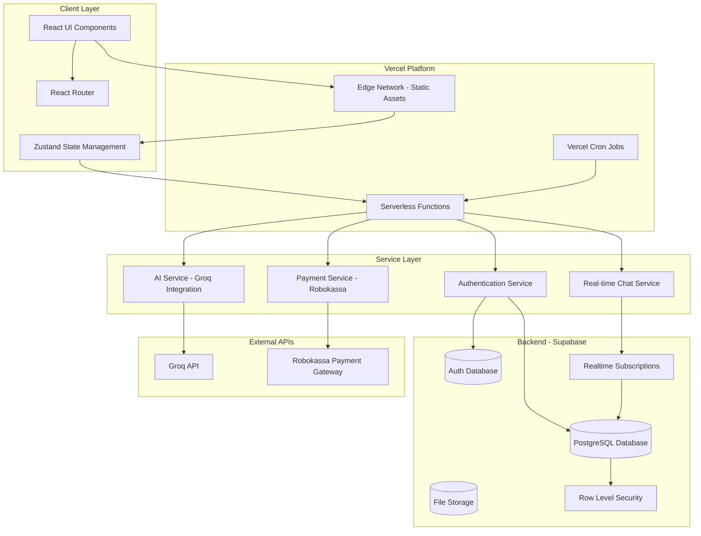

# Design Document: AILesson Platform

## Overview

AILesson (Alies AI) is a comprehensive educational platform built with React, TypeScript, and Supabase that enables AI-powered lesson creation, student progress tracking, and gamified learning experiences. The platform integrates with Groq API for AI-generated educational content and implements a token-based economy to manage resource usage.

The system supports four distinct user roles (students, teachers, parents, administrators) with role-specific features and subscription tiers. The architecture emphasizes real-time communication, secure authentication, and scalable data management through Supabase's backend services.

## Architecture

### High-Level Architecture



### Technology Stack

- **Frontend**: React 18, TypeScript, Vite
- **State Management**: Zustand (existing in codebase)
- **Routing**: React Router
- **Backend**: Supabase (PostgreSQL, Auth, Realtime, Storage)
- **Deployment**: Vercel (frontend hosting and serverless functions)
- **AI Integration**: Groq API (groq-sdk npm package)
- **Payment Processing**: Robokassa (existing integration)
- **Styling**: CSS Modules / Tailwind CSS (based on existing patterns)

### Design Principles

1. **Role-Based Access Control**: All features are gated by user roles with Supabase RLS policies
2. **Token Economy**: All AI operations consume Wisdom Coins to manage costs
3. **Real-time Updates**: Chat and leaderboard use Supabase Realtime subscriptions
4. **Optimistic UI**: Immediate feedback with background synchronization
5. **Mobile-First**: Responsive design for all screen sizes
6. **Serverless Architecture**: Vercel serverless functions for API routes and scheduled jobs (daily reset, biweekly grants)
7. **Edge Deployment**: Static assets served from Vercel Edge Network for optimal performance

## Components and Interfaces

### Core Data Models

#### User Profile
```typescript
interface UserProfile {
  id: string; // UUID from Supabase Auth
  email: string;
  role: 'student' | 'teacher' | 'parent' | 'administrator';
  full_name: string;
  school_id: string | null;
  subscription_tier: SubscriptionTier;
  wisdom_coins: number;
  daily_login_streak: number;
  last_login_date: string; // ISO date
  free_expert_queries_remaining: number;
  created_at: string;
  updated_at: string;
}

type SubscriptionTier = 
  | 'student_freemium' | 'student_promium' | 'student_premium' | 'student_legend'
  | 'teacher_freemium' | 'teacher_promium' | 'teacher_premium' | 'teacher_maxi';
```

#### School
```typescript
interface School {
  id: string;
  name: string;
  address: string;
  created_at: string;
  updated_at: string;
}

interface SchoolMembership {
  id: string;
  school_id: string;
  user_id: string;
  role: 'teacher' | 'parent' | 'student';
  joined_at: string;
}
```

#### Lesson
```typescript
interface Lesson {
  id: string;
  title: string;
  subject: Subject;
  content: string; // Markdown or HTML from AI
  creator_id: string;
  creator_role: 'student' | 'teacher';
  school_id: string | null;
  assigned_students: string[]; // User IDs
  attachments: LessonAttachment[];
  created_at: string;
  updated_at: string;
}

type Subject = 
  | 'mathematics' | 'russian_language' | 'physics' | 'geography' 
  | 'literature' | 'obzh' | 'physical_education' | 'biology' 
  | 'chemistry' | 'history' | 'social_studies' | 'informatics' 
  | 'programming' | 'music' | 'geometry' | 'probability_statistics';

interface LessonAttachment {
  id: string;
  lesson_id: string;
  file_name: string;
  file_url: string;
  file_type: 'literature' | 'poem' | 'song' | 'document' | 'other';
  uploaded_at: string;
}
```

#### Quiz
```typescript
interface Quiz {
  id: string;
  lesson_id: string;
  title: string;
  questions: QuizQuestion[];
  created_by: string;
  created_at: string;
}

interface QuizQuestion {
  id: string;
  question_text: string;
  options: string[];
  correct_answer_index: number;
  explanation?: string;
}

interface QuizAttempt {
  id: string;
  quiz_id: string;
  student_id: string;
  answers: number[]; // Indices of selected answers
  score_percentage: number;
  completed_at: string;
  counts_for_leaderboard: boolean;
}
```

#### Chat
```typescript
interface Chat {
  id: string;
  name: string;
  type: 'public' | 'school_parent' | 'school_teacher' | 'direct';
  school_id: string | null;
  invitation_code: string;
  created_by: string;
  created_at: string;
}

interface ChatMembership {
  id: string;
  chat_id: string;
  user_id: string;
  joined_at: string;
}

interface ChatMessage {
  id: string;
  chat_id: string;
  sender_id: string;
  content: string;
  sent_at: string;
}
```

#### Leaderboard
```typescript
interface LeaderboardEntry {
  id: string;
  student_id: string;
  date: string; // YYYY-MM-DD
  score: number;
  rank: number | null;
  reward_coins: number;
  updated_at: string;
}
```

#### Support Ticket
```typescript
interface SupportTicket {
  id: string;
  user_id: string;
  subject: string;
  description: string;
  status: 'open' | 'in_progress' | 'resolved' | 'closed';
  priority: 'low' | 'medium' | 'high';
  created_at: string;
  updated_at: string;
}

interface TicketMessage {
  id: string;
  ticket_id: string;
  sender_id: string;
  message: string;
  sent_at: string;
}
```

#### Transaction
```typescript
interface Transaction {
  id: string;
  user_id: string;
  amount: number; // Positive for credits, negative for debits
  transaction_type: 
    | 'initial_grant' 
    | 'daily_login' 
    | 'biweekly_grant' 
    | 'leaderboard_reward'
    | 'lesson_creation' 
    | 'quiz_creation' 
    | 'expert_chat_usage'
    | 'subscription_purchase';
  description: string;
  created_at: string;
}
```

### Service Interfaces

#### Authentication Service
```typescript
interface AuthService {
  // Registration
  registerStudent(email: string, password: string, fullName: string, schoolId: string): Promise<UserProfile>;
  registerOtherRole(email: string, password: string, fullName: string, role: 'teacher' | 'parent' | 'administrator'): Promise<UserProfile>;
  
  // Login
  login(email: string, password: string): Promise<UserProfile>;
  logout(): Promise<void>;
  
  // Session management
  getCurrentUser(): Promise<UserProfile | null>;
  updateProfile(userId: string, updates: Partial<UserProfile>): Promise<UserProfile>;
}
```

#### AI Service (Groq Integration)
```typescript
interface AIService {
  // Lesson generation
  generateLesson(topic: string, subject: Subject, material?: string): Promise<string>;
  
  // Quiz generation
  generateQuiz(lessonContent: string, questionCount: number): Promise<QuizQuestion[]>;
  
  // Expert chat
  sendExpertChatMessage(conversationHistory: ChatMessage[], newMessage: string): Promise<string>;
  
  // Token estimation
  estimateTokens(text: string): number;
}
```

#### Lesson Service
```typescript
interface LessonService {
  // CRUD operations
  createLesson(lesson: Omit<Lesson, 'id' | 'created_at' | 'updated_at'>): Promise<Lesson>;
  getLesson(lessonId: string): Promise<Lesson>;
  updateLesson(lessonId: string, updates: Partial<Lesson>): Promise<Lesson>;
  deleteLesson(lessonId: string): Promise<void>;
  
  // Assignment
  assignLessonToStudents(lessonId: string, studentIds: string[]): Promise<void>;
  getAssignedLessons(studentId: string): Promise<Lesson[]>;
  
  // Progress tracking
  getLessonProgress(lessonId: string, studentId: string): Promise<LessonProgress>;
}

interface LessonProgress {
  lesson_id: string;
  student_id: string;
  completed: boolean;
  quiz_attempts: QuizAttempt[];
  last_accessed: string;
}
```

#### Quiz Service
```typescript
interface QuizService {
  // CRUD operations
  createQuiz(quiz: Omit<Quiz, 'id' | 'created_at'>): Promise<Quiz>;
  getQuiz(quizId: string): Promise<Quiz>;
  
  // Quiz attempts
  submitQuizAttempt(attempt: Omit<QuizAttempt, 'id' | 'completed_at'>): Promise<QuizAttempt>;
  getQuizAttempts(quizId: string, studentId: string): Promise<QuizAttempt[]>;
  
  // Validation
  canCreateQuiz(lessonId: string): Promise<boolean>; // Check if quiz already exists
  canAttemptQuiz(quizId: string, studentId: string): Promise<boolean>; // Check attempt limits
}
```

#### Chat Service
```typescript
interface ChatService {
  // Chat management
  createChat(chat: Omit<Chat, 'id' | 'invitation_code' | 'created_at'>): Promise<Chat>;
  joinChatByInvitation(invitationCode: string, userId: string): Promise<Chat>;
  searchChats(query: string): Promise<Chat[]>;
  
  // Messaging
  sendMessage(chatId: string, senderId: string, content: string): Promise<ChatMessage>;
  subscribeToMessages(chatId: string, callback: (message: ChatMessage) => void): () => void;
  
  // Membership
  getChatMembers(chatId: string): Promise<UserProfile[]>;
  leaveChat(chatId: string, userId: string): Promise<void>;
}
```

#### Leaderboard Service
```typescript
interface LeaderboardService {
  // Score management
  updateScore(studentId: string, points: number): Promise<void>;
  getDailyLeaderboard(date: string): Promise<LeaderboardEntry[]>;
  
  // Daily reset (scheduled job)
  performDailyReset(): Promise<void>; // Awards top 3, resets scores
  
  // Student stats
  getStudentRank(studentId: string): Promise<number>;
  getStudentHistory(studentId: string, days: number): Promise<LeaderboardEntry[]>;
}
```

#### Token Economy Service
```typescript
interface TokenEconomyService {
  // Balance management
  getBalance(userId: string): Promise<number>;
  deductTokens(userId: string, amount: number, reason: string): Promise<Transaction>;
  grantTokens(userId: string, amount: number, reason: string): Promise<Transaction>;
  
  // Subscription benefits
  processDailyLogin(userId: string): Promise<Transaction | null>;
  processBiweeklyGrant(userId: string): Promise<Transaction>;
  
  // Cost calculations
  calculateLessonCost(): number; // Returns 5
  calculateQuizCost(): number; // Returns 5
  calculateExpertChatCost(tokens: number): number; // 1 coin per 2000 tokens
  
  // Validation
  hasEnoughTokens(userId: string, amount: number): Promise<boolean>;
}
```

#### Subscription Service
```typescript
interface SubscriptionService {
  // Subscription management
  purchaseSubscription(userId: string, tier: SubscriptionTier): Promise<void>;
  getSubscriptionDetails(tier: SubscriptionTier): SubscriptionDetails;
  
  // Benefits
  getFreeExpertQueries(tier: SubscriptionTier): number;
  getDailyLoginBonus(tier: SubscriptionTier): number;
  getBiweeklyGrant(tier: SubscriptionTier): number;
}

interface SubscriptionDetails {
  tier: SubscriptionTier;
  price: number; // In rubles
  biweekly_tokens: number;
  daily_login_tokens: number;
  free_expert_queries: number;
}
```

#### Support Service
```typescript
interface SupportTicketService {
  // Ticket management
  createTicket(ticket: Omit<SupportTicket, 'id' | 'status' | 'created_at' | 'updated_at'>): Promise<SupportTicket>;
  getTicket(ticketId: string): Promise<SupportTicket>;
  updateTicketStatus(ticketId: string, status: SupportTicket['status']): Promise<SupportTicket>;
  
  // Messaging
  sendTicketMessage(ticketId: string, senderId: string, message: string): Promise<TicketMessage>;
  getTicketMessages(ticketId: string): Promise<TicketMessage[]>;
  
  // Admin views
  getAllTickets(filters?: { status?: string; priority?: string }): Promise<SupportTicket[]>;
}
```

### UI Component Structure

```
src/
├── components/
│   ├── Layout.tsx (existing)
│   ├── MarkdownRenderer.tsx (existing)
│   ├── RobotEyes.tsx (existing)
│   ├── auth/
│   │   ├── LoginForm.tsx
│   │   ├── RegisterForm.tsx
│   │   └── RoleSelector.tsx
│   ├── lessons/
│   │   ├── LessonCard.tsx
│   │   ├── LessonEditor.tsx
│   │   ├── SubjectSelector.tsx
│   │   └── AttachmentUploader.tsx
│   ├── quiz/
│   │   ├── QuizCreator.tsx
│   │   ├── QuizPlayer.tsx
│   │   ├── QuestionEditor.tsx
│   │   └── ResultsDisplay.tsx
│   ├── chat/
│   │   ├── ChatList.tsx
│   │   ├── ChatWindow.tsx
│   │   ├── MessageBubble.tsx
│   │   └── InvitationLink.tsx
│   ├── leaderboard/
│   │   ├── LeaderboardTable.tsx
│   │   ├── RankBadge.tsx
│   │   └── StudentStats.tsx
│   ├── subscription/
│   │   ├── PricingCards.tsx
│   │   ├── SubscriptionBadge.tsx
│   │   └── TokenBalance.tsx
│   └── support/
│       ├── TicketForm.tsx
│       ├── TicketList.tsx
│       └── TicketChat.tsx
├── pages/ (existing structure)
│   ├── Login.tsx (existing)
│   ├── Register.tsx (existing)
│   ├── Dashboard.tsx (existing)
│   ├── LessonCreate.tsx (existing)
│   ├── LessonView.tsx (existing)
│   ├── LessonList.tsx (existing)
│   ├── MyLessons.tsx (existing)
│   ├── Chat.tsx (existing)
│   ├── AliesChat.tsx (existing - Expert Chat)
│   ├── Leaderboard.tsx (existing)
│   ├── Profile.tsx (existing)
│   ├── Pricing.tsx (existing)
│   ├── SchoolDashboard.tsx (existing)
│   ├── AdminPanel.tsx (existing)
│   └── Support.tsx (existing)
├── services/
│   ├── ai.ts (existing)
│   ├── supabase.ts (existing - lib/supabase.ts)
│   ├── robokassa.ts (existing)
│   ├── auth.service.ts
│   ├── lesson.service.ts
│   ├── quiz.service.ts
│   ├── chat.service.ts
│   ├── leaderboard.service.ts
│   ├── token-economy.service.ts
│   ├── subscription.service.ts
│   └── support.service.ts
└── store.ts (existing - Zustand)
```

## Data Models

### Database Schema (Supabase PostgreSQL)

```sql
-- Users table (extends Supabase auth.users)
CREATE TABLE user_profiles (
  id UUID PRIMARY KEY REFERENCES auth.users(id) ON DELETE CASCADE,
  email TEXT NOT NULL,
  role TEXT NOT NULL CHECK (role IN ('student', 'teacher', 'parent', 'administrator')),
  full_name TEXT NOT NULL,
  school_id UUID REFERENCES schools(id),
  subscription_tier TEXT NOT NULL,
  wisdom_coins INTEGER NOT NULL DEFAULT 0,
  daily_login_streak INTEGER NOT NULL DEFAULT 0,
  last_login_date DATE,
  free_expert_queries_remaining INTEGER NOT NULL DEFAULT 0,
  created_at TIMESTAMPTZ NOT NULL DEFAULT NOW(),
  updated_at TIMESTAMPTZ NOT NULL DEFAULT NOW()
);

-- Schools
CREATE TABLE schools (
  id UUID PRIMARY KEY DEFAULT gen_random_uuid(),
  name TEXT NOT NULL,
  address TEXT,
  created_at TIMESTAMPTZ NOT NULL DEFAULT NOW(),
  updated_at TIMESTAMPTZ NOT NULL DEFAULT NOW()
);

-- School memberships
CREATE TABLE school_memberships (
  id UUID PRIMARY KEY DEFAULT gen_random_uuid(),
  school_id UUID NOT NULL REFERENCES schools(id) ON DELETE CASCADE,
  user_id UUID NOT NULL REFERENCES user_profiles(id) ON DELETE CASCADE,
  role TEXT NOT NULL CHECK (role IN ('teacher', 'parent', 'student')),
  joined_at TIMESTAMPTZ NOT NULL DEFAULT NOW(),
  UNIQUE(school_id, user_id)
);

-- Parent-child relationships
CREATE TABLE parent_child_links (
  id UUID PRIMARY KEY DEFAULT gen_random_uuid(),
  parent_id UUID NOT NULL REFERENCES user_profiles(id) ON DELETE CASCADE,
  child_id UUID NOT NULL REFERENCES user_profiles(id) ON DELETE CASCADE,
  created_at TIMESTAMPTZ NOT NULL DEFAULT NOW(),
  UNIQUE(parent_id, child_id)
);

-- Lessons
CREATE TABLE lessons (
  id UUID PRIMARY KEY DEFAULT gen_random_uuid(),
  title TEXT NOT NULL,
  subject TEXT NOT NULL,
  content TEXT NOT NULL,
  creator_id UUID NOT NULL REFERENCES user_profiles(id) ON DELETE CASCADE,
  creator_role TEXT NOT NULL CHECK (creator_role IN ('student', 'teacher')),
  school_id UUID REFERENCES schools(id),
  created_at TIMESTAMPTZ NOT NULL DEFAULT NOW(),
  updated_at TIMESTAMPTZ NOT NULL DEFAULT NOW()
);

-- Lesson assignments
CREATE TABLE lesson_assignments (
  id UUID PRIMARY KEY DEFAULT gen_random_uuid(),
  lesson_id UUID NOT NULL REFERENCES lessons(id) ON DELETE CASCADE,
  student_id UUID NOT NULL REFERENCES user_profiles(id) ON DELETE CASCADE,
  assigned_at TIMESTAMPTZ NOT NULL DEFAULT NOW(),
  UNIQUE(lesson_id, student_id)
);

-- Lesson attachments
CREATE TABLE lesson_attachments (
  id UUID PRIMARY KEY DEFAULT gen_random_uuid(),
  lesson_id UUID NOT NULL REFERENCES lessons(id) ON DELETE CASCADE,
  file_name TEXT NOT NULL,
  file_url TEXT NOT NULL,
  file_type TEXT NOT NULL,
  uploaded_at TIMESTAMPTZ NOT NULL DEFAULT NOW()
);

-- Quizzes
CREATE TABLE quizzes (
  id UUID PRIMARY KEY DEFAULT gen_random_uuid(),
  lesson_id UUID NOT NULL REFERENCES lessons(id) ON DELETE CASCADE,
  title TEXT NOT NULL,
  questions JSONB NOT NULL,
  created_by UUID NOT NULL REFERENCES user_profiles(id) ON DELETE CASCADE,
  created_at TIMESTAMPTZ NOT NULL DEFAULT NOW(),
  UNIQUE(lesson_id) -- Only one quiz per lesson
);

-- Quiz attempts
CREATE TABLE quiz_attempts (
  id UUID PRIMARY KEY DEFAULT gen_random_uuid(),
  quiz_id UUID NOT NULL REFERENCES quizzes(id) ON DELETE CASCADE,
  student_id UUID NOT NULL REFERENCES user_profiles(id) ON DELETE CASCADE,
  answers INTEGER[] NOT NULL,
  score_percentage NUMERIC(5,2) NOT NULL,
  counts_for_leaderboard BOOLEAN NOT NULL,
  completed_at TIMESTAMPTZ NOT NULL DEFAULT NOW()
);

-- Chats
CREATE TABLE chats (
  id UUID PRIMARY KEY DEFAULT gen_random_uuid(),
  name TEXT NOT NULL,
  type TEXT NOT NULL CHECK (type IN ('public', 'school_parent', 'school_teacher', 'direct')),
  school_id UUID REFERENCES schools(id),
  invitation_code TEXT NOT NULL UNIQUE,
  created_by UUID NOT NULL REFERENCES user_profiles(id) ON DELETE CASCADE,
  created_at TIMESTAMPTZ NOT NULL DEFAULT NOW()
);

-- Chat memberships
CREATE TABLE chat_memberships (
  id UUID PRIMARY KEY DEFAULT gen_random_uuid(),
  chat_id UUID NOT NULL REFERENCES chats(id) ON DELETE CASCADE,
  user_id UUID NOT NULL REFERENCES user_profiles(id) ON DELETE CASCADE,
  joined_at TIMESTAMPTZ NOT NULL DEFAULT NOW(),
  UNIQUE(chat_id, user_id)
);

-- Chat messages
CREATE TABLE chat_messages (
  id UUID PRIMARY KEY DEFAULT gen_random_uuid(),
  chat_id UUID NOT NULL REFERENCES chats(id) ON DELETE CASCADE,
  sender_id UUID NOT NULL REFERENCES user_profiles(id) ON DELETE CASCADE,
  content TEXT NOT NULL,
  sent_at TIMESTAMPTZ NOT NULL DEFAULT NOW()
);

-- Leaderboard entries
CREATE TABLE leaderboard_entries (
  id UUID PRIMARY KEY DEFAULT gen_random_uuid(),
  student_id UUID NOT NULL REFERENCES user_profiles(id) ON DELETE CASCADE,
  date DATE NOT NULL,
  score INTEGER NOT NULL DEFAULT 0,
  rank INTEGER,
  reward_coins INTEGER NOT NULL DEFAULT 0,
  updated_at TIMESTAMPTZ NOT NULL DEFAULT NOW(),
  UNIQUE(student_id, date)
);

-- Support tickets
CREATE TABLE support_tickets (
  id UUID PRIMARY KEY DEFAULT gen_random_uuid(),
  user_id UUID NOT NULL REFERENCES user_profiles(id) ON DELETE CASCADE,
  subject TEXT NOT NULL,
  description TEXT NOT NULL,
  status TEXT NOT NULL CHECK (status IN ('open', 'in_progress', 'resolved', 'closed')),
  priority TEXT NOT NULL CHECK (priority IN ('low', 'medium', 'high')),
  created_at TIMESTAMPTZ NOT NULL DEFAULT NOW(),
  updated_at TIMESTAMPTZ NOT NULL DEFAULT NOW()
);

-- Ticket messages
CREATE TABLE ticket_messages (
  id UUID PRIMARY KEY DEFAULT gen_random_uuid(),
  ticket_id UUID NOT NULL REFERENCES support_tickets(id) ON DELETE CASCADE,
  sender_id UUID NOT NULL REFERENCES user_profiles(id) ON DELETE CASCADE,
  message TEXT NOT NULL,
  sent_at TIMESTAMPTZ NOT NULL DEFAULT NOW()
);

-- Transactions
CREATE TABLE transactions (
  id UUID PRIMARY KEY DEFAULT gen_random_uuid(),
  user_id UUID NOT NULL REFERENCES user_profiles(id) ON DELETE CASCADE,
  amount INTEGER NOT NULL,
  transaction_type TEXT NOT NULL,
  description TEXT NOT NULL,
  created_at TIMESTAMPTZ NOT NULL DEFAULT NOW()
);

-- Indexes for performance
CREATE INDEX idx_lessons_creator ON lessons(creator_id);
CREATE INDEX idx_lessons_school ON lessons(school_id);
CREATE INDEX idx_quiz_attempts_student ON quiz_attempts(student_id);
CREATE INDEX idx_chat_messages_chat ON chat_messages(chat_id);
CREATE INDEX idx_leaderboard_date ON leaderboard_entries(date, score DESC);
CREATE INDEX idx_transactions_user ON transactions(user_id, created_at DESC);
```

### Row Level Security (RLS) Policies

Content was rephrased for compliance with licensing restrictions.

Key RLS principles:
- Students can view their own data and assigned lessons
- Teachers can view/edit lessons they created and student progress in their school
- Parents can view their children's data
- Administrators have full access
- All users can only modify their own profile (except admins)

## Correctness Properties

A property is a characteristic or behavior that should hold true across all valid executions of a system—essentially, a formal statement about what the system should do. Properties serve as the bridge between human-readable specifications and machine-verifiable correctness guarantees.

### User Registration and Initial Grants

**Property 1: Student registration grants initial tokens and school assignment**
*For any* valid student registration with email, password, full name, and school ID, the created account should have exactly 50 Wisdom_Coins and be associated with the selected school.
**Validates: Requirements 1.1**

**Property 2: Teacher registration grants initial tokens**
*For any* valid teacher registration, the created account should have exactly 150 Wisdom_Coins.
**Validates: Requirements 1.3**

**Property 3: Role assignment correctness**
*For any* user registration with a specified role (teacher, parent, administrator), the created account should have that exact role assigned.
**Validates: Requirements 1.2**

**Property 4: School assignment immutability**
*For any* student account, after registration the school_id field should not be modifiable through standard profile update operations.
**Validates: Requirements 1.5**

### Token Economy

**Property 5: Lesson creation cost**
*For any* user creating a lesson, their Wisdom_Coins balance should decrease by exactly 5 coins.
**Validates: Requirements 2.2, 13.1**

**Property 6: Quiz creation cost**
*For any* user creating a quiz, their Wisdom_Coins balance should decrease by exactly 5 coins.
**Validates: Requirements 3.1, 13.2**

**Property 7: Expert chat token calculation**
*For any* expert chat message with N tokens, the cost should be ceiling(N / 2000) Wisdom_Coins.
**Validates: Requirements 11.1, 13.3**

**Property 8: Insufficient balance rejection**
*For any* paid operation (lesson creation, quiz creation, expert chat) when a user has insufficient Wisdom_Coins, the operation should be rejected and the balance should remain unchanged.
**Validates: Requirements 13.4, 11.4**

**Property 9: Transaction history completeness**
*For any* user, the sum of all transaction amounts in their transaction history should equal their current Wisdom_Coins balance.
**Validates: Requirements 13.5**

### Subscription Benefits

**Property 10: Subscription benefit calculation**
*For any* subscription tier, the biweekly grant, daily login bonus, and free expert queries should match the tier's defined benefits exactly.
**Validates: Requirements 9.1-9.12, 10.1-10.12**

**Property 11: Free expert query consumption**
*For any* user with free expert queries remaining, sending an expert chat message should decrement free_expert_queries_remaining by 1 and not deduct Wisdom_Coins.
**Validates: Requirements 11.2**

**Property 12: Paid expert query after free exhaustion**
*For any* user with zero free expert queries remaining, sending an expert chat message should deduct Wisdom_Coins and not change free_expert_queries_remaining.
**Validates: Requirements 11.3**

### Lesson and Quiz Management

**Property 13: Lesson metadata completeness**
*For any* created lesson, the stored record should contain non-null values for creator_id, subject, creation date, and content.
**Validates: Requirements 2.5**

**Property 14: One quiz per lesson constraint**
*For any* lesson that already has a quiz, attempting to create a second quiz for that lesson should be rejected.
**Validates: Requirements 3.2**

**Property 15: Quiz score calculation**
*For any* quiz attempt with N questions and M correct answers, the score_percentage should equal (M / N) * 100.
**Validates: Requirements 3.5**

**Property 16: Unlimited attempts for self-created lessons**
*For any* student and quiz where the quiz's lesson was created by that student, the student should be able to submit multiple quiz attempts.
**Validates: Requirements 3.3**

**Property 17: Single attempt for teacher-created lessons**
*For any* student and quiz where the quiz's lesson was created by a teacher, after the student submits one attempt, subsequent attempt submissions should be rejected.
**Validates: Requirements 3.4**

**Property 18: Leaderboard counting for self-created lessons**
*For any* quiz attempt where the lesson was created by the student taking the quiz, the counts_for_leaderboard field should be true and the student's leaderboard score should increase.
**Validates: Requirements 3.6**

**Property 19: Leaderboard exclusion for teacher-created lessons**
*For any* quiz attempt where the lesson was created by a teacher, the counts_for_leaderboard field should be false and the student's leaderboard score should not change.
**Validates: Requirements 3.7**

**Property 20: Lesson assignment creates access**
*For any* teacher-created lesson assigned to a student, that student should be able to retrieve the lesson through their assigned lessons query.
**Validates: Requirements 4.1**

**Property 21: Progress visibility for teachers**
*For any* lesson created by a teacher and assigned to students, the teacher should be able to retrieve progress data (completion status, quiz attempts) for all assigned students.
**Validates: Requirements 4.3**

**Property 22: Attachment accessibility**
*For any* lesson with attachments assigned to a student, that student should be able to retrieve all attachment URLs.
**Validates: Requirements 4.5**

### Parent Monitoring

**Property 23: Parent-child data access**
*For any* parent-child link, the parent should be able to retrieve the child's completed lessons, quiz results, and leaderboard position.
**Validates: Requirements 5.1, 5.2**

**Property 24: School-based chat access for parents**
*For any* parent who is a member of a school, that parent should have access to all parent chats and teacher chats associated with that school.
**Validates: Requirements 5.3, 5.4**

### School Organization

**Property 25: Teacher school assignment**
*For any* school and teacher, creating a school membership with role 'teacher' should succeed and grant the teacher access to school-specific features.
**Validates: Requirements 6.1**

**Property 26: Parent school joining**
*For any* school that has at least one teacher member, a parent should be able to join that school.
**Validates: Requirements 6.2**

**Property 27: Student school requirement**
*For any* student registration attempt without a school_id, the registration should be rejected.
**Validates: Requirements 6.3**

### Chat and Communication

**Property 28: Unique invitation codes**
*For any* two different chats, their invitation codes should be different.
**Validates: Requirements 7.1**

**Property 29: Invitation code join mechanism**
*For any* valid invitation code and user, joining the chat should create a chat membership record and grant access to chat messages.
**Validates: Requirements 7.2**

**Property 30: Public chat search visibility**
*For any* chat with type 'public', it should appear in search results for all users.
**Validates: Requirements 7.3**

### Leaderboard and Daily Reset

**Property 31: Quiz completion updates leaderboard**
*For any* student completing a quiz that counts for the leaderboard, their leaderboard entry for the current date should have its score increased.
**Validates: Requirements 8.1**

**Property 32: Daily reset reward distribution**
*For any* daily reset, the top 3 students should receive 50, 25, and 10 Wisdom_Coins respectively, and all other students should receive 0 coins.
**Validates: Requirements 8.2, 8.3, 8.4**

**Property 33: Daily reset score clearing**
*For any* daily reset, all leaderboard entries for the previous date should have their scores set to 0 for the new date.
**Validates: Requirements 8.5**

### Support Tickets

**Property 34: Administrator ticket visibility**
*For any* support ticket, all users with role 'administrator' should be able to retrieve that ticket with full user information.
**Validates: Requirements 12.2**

**Property 35: Ticket status transitions**
*For any* support ticket, updating its status to 'resolved' or 'closed' should persist that status change.
**Validates: Requirements 12.5**

### Daily Login System

**Property 36: Daily login reward calculation**
*For any* user logging in for the first time in a calendar day, they should receive Wisdom_Coins equal to their subscription tier's daily login bonus.
**Validates: Requirements 15.1, 15.2**

**Property 37: Daily login idempotence**
*For any* user logging in multiple times within the same calendar day, only the first login should grant the daily reward.
**Validates: Requirements 15.3**

**Property 38: Login streak tracking**
*For any* user logging in on consecutive calendar days, their daily_login_streak should increment by 1 each day.
**Validates: Requirements 15.4**

**Property 39: Daily eligibility reset**
*For any* user, when a new calendar day begins, they should become eligible for the daily login reward again.
**Validates: Requirements 15.5**

## Error Handling

### Authentication Errors
- Invalid credentials: Return 401 with clear error message
- Duplicate email registration: Return 409 with "Email already exists"
- Missing required fields: Return 400 with field-specific errors
- Invalid role: Return 400 with "Invalid role specified"

### Token Economy Errors
- Insufficient balance: Return 402 with current balance and required amount
- Invalid transaction amount: Return 400 with "Amount must be positive"
- Concurrent balance modifications: Use database transactions with row-level locking

### Lesson and Quiz Errors
- Lesson not found: Return 404 with "Lesson not found"
- Quiz already exists for lesson: Return 409 with "Quiz already exists for this lesson"
- Unauthorized access: Return 403 with "You don't have permission to access this resource"
- Invalid subject: Return 400 with list of valid subjects
- Attempt limit exceeded: Return 403 with "You have already completed this quiz"

### Chat Errors
- Invalid invitation code: Return 404 with "Chat not found"
- Already a member: Return 409 with "You are already a member of this chat"
- Chat not found: Return 404 with "Chat not found"

### Groq API Errors
- API key invalid: Log error, return 500 with "AI service temporarily unavailable"
- Rate limit exceeded: Return 429 with "Too many requests, please try again later"
- Timeout: Retry up to 3 times with exponential backoff, then return 504
- Invalid response: Log error, return 500 with "Failed to generate content"

### Supabase Errors
- Connection timeout: Retry with exponential backoff
- RLS policy violation: Return 403 with "Access denied"
- Unique constraint violation: Return 409 with specific constraint error
- Foreign key violation: Return 400 with "Referenced resource not found"

## Testing Strategy

### Unit Testing
Unit tests will verify specific examples, edge cases, and error conditions for individual functions and components. Focus areas:
- Token calculation functions (cost calculations, balance updates)
- Quiz scoring logic
- Subscription benefit lookups
- Date/time utilities (daily reset timing, streak calculations)
- Input validation functions
- Error handling paths

### Property-Based Testing
Property-based tests will verify universal properties across all inputs using a PBT library. Each test will:
- Run minimum 100 iterations with randomized inputs
- Reference the design document property number
- Use tag format: **Feature: ailesson-platform, Property N: [property text]**

**PBT Library Selection**: 
- For TypeScript: Use `fast-check` library
- Install: `npm install --save-dev fast-check @types/fast-check`

**Property Test Coverage**:
- All 39 correctness properties listed above must have corresponding property tests
- Each property test validates the universal behavior across randomized inputs
- Properties involving external APIs (Groq, Supabase) will use test doubles for the API layer while testing business logic

**Example Property Test Structure**:
```typescript
import fc from 'fast-check';

// Feature: ailesson-platform, Property 1: Student registration grants initial tokens and school assignment
test('student registration grants 50 coins and school assignment', () => {
  fc.assert(
    fc.property(
      fc.emailAddress(),
      fc.string({ minLength: 8 }),
      fc.string({ minLength: 1 }),
      fc.uuid(),
      async (email, password, fullName, schoolId) => {
        const profile = await authService.registerStudent(email, password, fullName, schoolId);
        expect(profile.wisdom_coins).toBe(50);
        expect(profile.school_id).toBe(schoolId);
      }
    ),
    { numRuns: 100 }
  );
});
```

### Integration Testing
Integration tests will verify:
- Supabase RLS policies enforce correct access control
- Real-time subscriptions deliver messages correctly
- File upload and storage workflows
- End-to-end user flows (registration → lesson creation → quiz completion)
- Payment integration with Robokassa

### Testing Approach Balance
- Property tests handle comprehensive input coverage through randomization
- Unit tests focus on specific examples, edge cases, and error conditions
- Integration tests verify component interactions and external service integrations
- Both unit and property tests are necessary for comprehensive coverage

### Test Data Management
- Use Supabase test database with isolated schemas per test suite
- Reset database state between test runs
- Use factories to generate valid test data
- Mock Groq API responses for consistent testing

### Continuous Integration
- Run all tests on every commit
- Require 100% property test pass rate
- Maintain >80% code coverage for business logic
- Run integration tests on staging environment before production deployment

### Deployment Strategy (Vercel)
- **Static Site**: React app built with Vite and deployed to Vercel Edge Network
- **Serverless Functions**: API routes in `/api` directory for server-side operations
- **Environment Variables**: Store Supabase credentials, Groq API key, and Robokassa keys in Vercel environment variables
- **Scheduled Jobs**: Use Vercel Cron Jobs for:
  - Daily leaderboard reset at 18:00 (cron: `0 18 * * *`)
  - Biweekly token grants (cron: `0 0 */14 * *`)
  - Daily login eligibility reset at midnight (cron: `0 0 * * *`)
- **Preview Deployments**: Automatic preview deployments for pull requests
- **Production Deployment**: Automatic deployment from main branch
