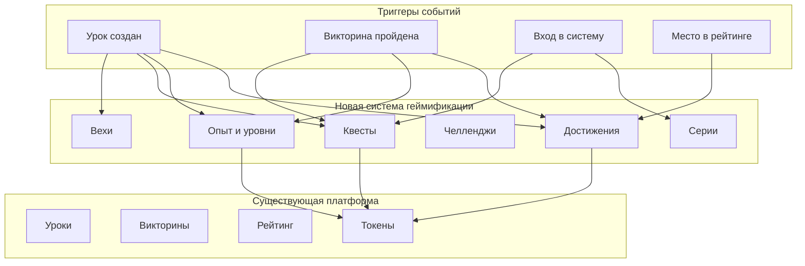

# Документ дизайна: Система достижений и геймификации

## Обзор

Система достижений и геймификации расширяет платформу AILesson, добавляя механики, которые повышают мотивацию и вовлеченность учеников. Система включает достижения, систему опыта и уровней, ежедневные/еженедельные квесты, челленджи, вехи, визуализацию прогресса и сезонные события.

Архитектура интегрируется с существующей платформой AILesson, используя те же технологии (React, TypeScript, Supabase, Vercel) и расширяя текущую базу данных новыми таблицами.

## Архитектура

### Высокоуровневая архитектура



### Стек технологий

- **Frontend**: React 18, TypeScript, Vite (существующий)
- **State Management**: Zustand (существующий)
- **Backend**: Supabase PostgreSQL (существующий)
- **Deployment**: Vercel (существующий)
- **Новые библиотеки**: 
  - `react-spring` для анимаций
  - `recharts` для графиков (уже установлен)


## Компоненты и интерфейсы

### Основные модели данных

#### Achievement (Достижение)
```typescript
interface Achievement {
  id: string;
  code: string; // Уникальный код достижения (например, 'first_lesson')
  title: string;
  description: string;
  category: AchievementCategory;
  rarity: AchievementRarity;
  icon: string; // URL или имя иконки
  reward_coins: number;
  reward_xp: number;
  condition_type: ConditionType;
  condition_value: number;
  created_at: string;
}

type AchievementCategory = 
  | 'learning' // Обучение
  | 'social' // Социальные
  | 'achievement' // Достижения
  | 'special'; // Особые

type AchievementRarity = 
  | 'common' // Обычное (25 монет)
  | 'rare' // Редкое (50 монет)
  | 'epic' // Эпическое (100 монет)
  | 'legendary'; // Легендарное (250 монет)

type ConditionType =
  | 'lesson_created' // Создано уроков
  | 'quiz_completed' // Пройдено викторин
  | 'quiz_perfect' // Викторин с 100%
  | 'login_streak' // Дней входа подряд
  | 'leaderboard_first' // Раз на 1 месте
  | 'subjects_studied' // Изучено предметов
  | 'level_reached' // Достигнут уровень
  | 'challenge_won' // Выиграно челленджей
  | 'quest_completed'; // Выполнено квестов
```

#### UserAchievement (Достижение пользователя)
```typescript
interface UserAchievement {
  id: string;
  user_id: string;
  achievement_id: string;
  progress: number; // Текущий прогресс к достижению
  unlocked: boolean;
  unlocked_at: string | null;
  is_favorite: boolean; // Избранное для отображения в профиле
  created_at: string;
}
```

#### UserLevel (Уровень пользователя)
```typescript
interface UserLevel {
  id: string;
  user_id: string;
  level: number;
  experience_points: number;
  experience_to_next_level: number;
  total_experience: number;
  updated_at: string;
}
```

#### Quest (Квест)
```typescript
interface Quest {
  id: string;
  type: QuestType;
  title: string;
  description: string;
  quest_type: 'daily' | 'weekly';
  condition_type: QuestConditionType;
  condition_value: number;
  reward_coins: number;
  reward_xp: number;
  active_from: string; // Дата начала
  active_until: string; // Дата окончания
  created_at: string;
}

type QuestConditionType =
  | 'create_lessons' // Создать N уроков
  | 'complete_quizzes' // Пройти N викторин
  | 'quiz_score_above' // Получить N% в викторине
  | 'leaderboard_top' // Войти в топ-N
  | 'expert_chat_messages' // Отправить N сообщений
  | 'study_subjects'; // Изучить N предметов
```

#### UserQuest (Квест пользователя)
```typescript
interface UserQuest {
  id: string;
  user_id: string;
  quest_id: string;
  progress: number;
  completed: boolean;
  completed_at: string | null;
  reward_claimed: boolean;
  created_at: string;
}
```

#### Challenge (Челлендж)
```typescript
interface Challenge {
  id: string;
  creator_id: string;
  title: string;
  description: string;
  challenge_type: ChallengeType;
  target_value: number;
  start_date: string;
  end_date: string;
  reward_coins: number;
  reward_xp: number;
  status: 'pending' | 'active' | 'completed' | 'cancelled';
  winner_id: string | null;
  created_at: string;
}

type ChallengeType =
  | 'most_lessons' // Больше всего уроков
  | 'most_quizzes' // Больше всего викторин
  | 'highest_score'; // Больше всего очков в рейтинге
```

#### ChallengeParticipant (Участник челленджа)
```typescript
interface ChallengeParticipant {
  id: string;
  challenge_id: string;
  user_id: string;
  progress: number;
  status: 'invited' | 'accepted' | 'declined';
  joined_at: string;
}
```

#### Milestone (Веха)
```typescript
interface Milestone {
  id: string;
  code: string;
  title: string;
  description: string;
  category: MilestoneCategory;
  threshold: number;
  reward_coins: number;
  reward_xp: number;
  icon: string;
  created_at: string;
}

type MilestoneCategory =
  | 'lessons_created'
  | 'quizzes_completed'
  | 'wisdom_coins'
  | 'level_reached';
```

#### UserMilestone (Веха пользователя)
```typescript
interface UserMilestone {
  id: string;
  user_id: string;
  milestone_id: string;
  achieved: boolean;
  achieved_at: string | null;
  created_at: string;
}
```

#### Streak (Серия)
```typescript
interface Streak {
  id: string;
  user_id: string;
  streak_type: StreakType;
  current_count: number;
  best_count: number;
  last_activity_date: string;
  created_at: string;
  updated_at: string;
}

type StreakType =
  | 'daily_login' // Ежедневный вход (уже существует)
  | 'lesson_creation' // Создание уроков
  | 'quiz_completion' // Прохождение викторин
  | 'quest_completion'; // Выполнение квестов
```

#### SeasonalEvent (Сезонное событие)
```typescript
interface SeasonalEvent {
  id: string;
  name: string;
  description: string;
  theme: string; // CSS класс для темы
  start_date: string;
  end_date: string;
  active: boolean;
  special_quests: string[]; // ID специальных квестов
  special_achievements: string[]; // ID специальных достижений
  created_at: string;
}
```

#### UserSeasonalProgress (Прогресс в сезонном событии)
```typescript
interface UserSeasonalProgress {
  id: string;
  user_id: string;
  event_id: string;
  seasonal_points: number;
  rank: number | null;
  rewards_claimed: boolean;
  created_at: string;
  updated_at: string;
}
```


### Интерфейсы сервисов

#### Achievement Service
```typescript
interface AchievementService {
  // Получение достижений
  getAllAchievements(): Promise<Achievement[]>;
  getUserAchievements(userId: string): Promise<UserAchievement[]>;
  getAchievementProgress(userId: string, achievementId: string): Promise<UserAchievement>;
  
  // Проверка и разблокировка
  checkAchievements(userId: string, eventType: string, value: number): Promise<UserAchievement[]>;
  unlockAchievement(userId: string, achievementId: string): Promise<UserAchievement>;
  
  // Управление избранными
  setFavoriteAchievement(userId: string, achievementId: string, isFavorite: boolean): Promise<void>;
  getFavoriteAchievements(userId: string): Promise<UserAchievement[]>;
  
  // Статистика
  getAchievementStats(userId: string): Promise<AchievementStats>;
}

interface AchievementStats {
  total_achievements: number;
  unlocked_achievements: number;
  completion_percentage: number;
  by_category: Record<AchievementCategory, number>;
  by_rarity: Record<AchievementRarity, number>;
}
```

#### Experience Service
```typescript
interface ExperienceService {
  // Управление опытом
  getUserLevel(userId: string): Promise<UserLevel>;
  addExperience(userId: string, amount: number, reason: string): Promise<UserLevel>;
  calculateLevelProgress(level: number, currentXP: number): LevelProgress;
  
  // Расчеты
  calculateXPForNextLevel(level: number): number; // 100 * (level ^ 1.5)
  calculateLevelFromXP(totalXP: number): number;
  
  // Награды за уровень
  getLevelUpReward(newLevel: number): LevelReward;
}

interface LevelProgress {
  current_level: number;
  current_xp: number;
  xp_to_next_level: number;
  progress_percentage: number;
}

interface LevelReward {
  coins: number;
  achievement_id?: string;
}
```

#### Quest Service
```typescript
interface QuestService {
  // Получение квестов
  getActiveQuests(userId: string, type?: 'daily' | 'weekly'): Promise<UserQuest[]>;
  getUserQuestProgress(userId: string, questId: string): Promise<UserQuest>;
  
  // Генерация квестов
  generateDailyQuests(userId: string): Promise<Quest[]>;
  generateWeeklyQuests(userId: string): Promise<Quest[]>;
  
  // Обновление прогресса
  updateQuestProgress(userId: string, questId: string, progress: number): Promise<UserQuest>;
  completeQuest(userId: string, questId: string): Promise<QuestReward>;
  claimQuestReward(userId: string, questId: string): Promise<void>;
  
  // Сброс квестов
  resetDailyQuests(): Promise<void>; // Cron job
  resetWeeklyQuests(): Promise<void>; // Cron job
  
  // Проверка выполнения
  checkQuestCompletion(userId: string, eventType: string, value: number): Promise<UserQuest[]>;
}

interface QuestReward {
  coins: number;
  xp: number;
  bonus_coins?: number; // Если все квесты выполнены
}
```

#### Challenge Service
```typescript
interface ChallengeService {
  // CRUD операции
  createChallenge(challenge: Omit<Challenge, 'id' | 'created_at'>): Promise<Challenge>;
  getChallenge(challengeId: string): Promise<Challenge>;
  getUserChallenges(userId: string): Promise<Challenge[]>;
  
  // Управление участниками
  inviteToChallenge(challengeId: string, userIds: string[]): Promise<void>;
  acceptChallenge(challengeId: string, userId: string): Promise<void>;
  declineChallenge(challengeId: string, userId: string): Promise<void>;
  
  // Прогресс
  updateChallengeProgress(challengeId: string, userId: string, progress: number): Promise<void>;
  getChallengeLeaderboard(challengeId: string): Promise<ChallengeParticipant[]>;
  
  // Завершение
  completeChallenge(challengeId: string): Promise<ChallengeResult>;
  cancelChallenge(challengeId: string): Promise<void>;
}

interface ChallengeResult {
  winner_id: string;
  winner_progress: number;
  rewards: {
    coins: number;
    xp: number;
  };
}
```

#### Milestone Service
```typescript
interface MilestoneService {
  // Получение вех
  getAllMilestones(): Promise<Milestone[]>;
  getUserMilestones(userId: string): Promise<UserMilestone[]>;
  getMilestonesByCategory(category: MilestoneCategory): Promise<Milestone[]>;
  
  // Проверка и достижение
  checkMilestones(userId: string, category: MilestoneCategory, value: number): Promise<UserMilestone[]>;
  achieveMilestone(userId: string, milestoneId: string): Promise<MilestoneReward>;
  
  // Прогресс
  getMilestoneProgress(userId: string, milestoneId: string): Promise<MilestoneProgress>;
}

interface MilestoneProgress {
  milestone: Milestone;
  current_value: number;
  progress_percentage: number;
  achieved: boolean;
}

interface MilestoneReward {
  coins: number;
  xp: number;
  special_achievement_id?: string;
}
```

#### Streak Service
```typescript
interface StreakService {
  // Получение серий
  getUserStreaks(userId: string): Promise<Streak[]>;
  getStreak(userId: string, type: StreakType): Promise<Streak>;
  
  // Обновление серий
  updateStreak(userId: string, type: StreakType): Promise<Streak>;
  breakStreak(userId: string, type: StreakType): Promise<void>;
  
  // Награды за серии
  getStreakReward(type: StreakType, count: number): StreakReward | null;
  claimStreakReward(userId: string, type: StreakType): Promise<StreakReward>;
}

interface StreakReward {
  coins: number;
  xp: number;
  achievement_id?: string;
}
```

#### Seasonal Event Service
```typescript
interface SeasonalEventService {
  // Управление событиями
  getActiveEvent(): Promise<SeasonalEvent | null>;
  getAllEvents(): Promise<SeasonalEvent[]>;
  
  // Прогресс пользователя
  getUserEventProgress(userId: string, eventId: string): Promise<UserSeasonalProgress>;
  addSeasonalPoints(userId: string, eventId: string, points: number): Promise<void>;
  
  // Таблица лидеров
  getEventLeaderboard(eventId: string, limit?: number): Promise<UserSeasonalProgress[]>;
  
  // Награды
  claimEventRewards(userId: string, eventId: string): Promise<EventReward>;
}

interface EventReward {
  coins: number;
  xp: number;
  special_badges: string[];
}
```

#### Gamification Orchestrator Service
```typescript
interface GamificationOrchestratorService {
  // Обработка событий платформы
  onLessonCreated(userId: string): Promise<GamificationResult>;
  onQuizCompleted(userId: string, score: number): Promise<GamificationResult>;
  onLogin(userId: string): Promise<GamificationResult>;
  onLeaderboardRank(userId: string, rank: number): Promise<GamificationResult>;
  onExpertChatMessage(userId: string): Promise<GamificationResult>;
  
  // Комплексная проверка
  checkAllProgress(userId: string, eventType: string, value: number): Promise<GamificationResult>;
}

interface GamificationResult {
  achievements_unlocked: UserAchievement[];
  quests_completed: UserQuest[];
  milestones_achieved: UserMilestone[];
  level_up: boolean;
  new_level?: number;
  total_coins_earned: number;
  total_xp_earned: number;
  notifications: GamificationNotification[];
}

interface GamificationNotification {
  type: 'achievement' | 'level_up' | 'quest' | 'milestone' | 'streak';
  title: string;
  message: string;
  icon?: string;
  animation?: string;
}
```


## Модели данных

### Схема базы данных (Supabase PostgreSQL)

```sql
-- Достижения
CREATE TABLE achievements (
  id UUID PRIMARY KEY DEFAULT gen_random_uuid(),
  code TEXT NOT NULL UNIQUE,
  title TEXT NOT NULL,
  description TEXT NOT NULL,
  category TEXT NOT NULL CHECK (category IN ('learning', 'social', 'achievement', 'special')),
  rarity TEXT NOT NULL CHECK (rarity IN ('common', 'rare', 'epic', 'legendary')),
  icon TEXT NOT NULL,
  reward_coins INTEGER NOT NULL,
  reward_xp INTEGER NOT NULL,
  condition_type TEXT NOT NULL,
  condition_value INTEGER NOT NULL,
  created_at TIMESTAMPTZ NOT NULL DEFAULT NOW()
);

-- Достижения пользователей
CREATE TABLE user_achievements (
  id UUID PRIMARY KEY DEFAULT gen_random_uuid(),
  user_id UUID NOT NULL REFERENCES user_profiles(id) ON DELETE CASCADE,
  achievement_id UUID NOT NULL REFERENCES achievements(id) ON DELETE CASCADE,
  progress INTEGER NOT NULL DEFAULT 0,
  unlocked BOOLEAN NOT NULL DEFAULT FALSE,
  unlocked_at TIMESTAMPTZ,
  is_favorite BOOLEAN NOT NULL DEFAULT FALSE,
  created_at TIMESTAMPTZ NOT NULL DEFAULT NOW(),
  UNIQUE(user_id, achievement_id)
);

-- Уровни пользователей
CREATE TABLE user_levels (
  id UUID PRIMARY KEY DEFAULT gen_random_uuid(),
  user_id UUID NOT NULL REFERENCES user_profiles(id) ON DELETE CASCADE UNIQUE,
  level INTEGER NOT NULL DEFAULT 1,
  experience_points INTEGER NOT NULL DEFAULT 0,
  experience_to_next_level INTEGER NOT NULL DEFAULT 100,
  total_experience INTEGER NOT NULL DEFAULT 0,
  updated_at TIMESTAMPTZ NOT NULL DEFAULT NOW()
);

-- Квесты
CREATE TABLE quests (
  id UUID PRIMARY KEY DEFAULT gen_random_uuid(),
  title TEXT NOT NULL,
  description TEXT NOT NULL,
  quest_type TEXT NOT NULL CHECK (quest_type IN ('daily', 'weekly')),
  condition_type TEXT NOT NULL,
  condition_value INTEGER NOT NULL,
  reward_coins INTEGER NOT NULL,
  reward_xp INTEGER NOT NULL,
  active_from TIMESTAMPTZ NOT NULL,
  active_until TIMESTAMPTZ NOT NULL,
  created_at TIMESTAMPTZ NOT NULL DEFAULT NOW()
);

-- Квесты пользователей
CREATE TABLE user_quests (
  id UUID PRIMARY KEY DEFAULT gen_random_uuid(),
  user_id UUID NOT NULL REFERENCES user_profiles(id) ON DELETE CASCADE,
  quest_id UUID NOT NULL REFERENCES quests(id) ON DELETE CASCADE,
  progress INTEGER NOT NULL DEFAULT 0,
  completed BOOLEAN NOT NULL DEFAULT FALSE,
  completed_at TIMESTAMPTZ,
  reward_claimed BOOLEAN NOT NULL DEFAULT FALSE,
  created_at TIMESTAMPTZ NOT NULL DEFAULT NOW(),
  UNIQUE(user_id, quest_id)
);

-- Челленджи
CREATE TABLE challenges (
  id UUID PRIMARY KEY DEFAULT gen_random_uuid(),
  creator_id UUID NOT NULL REFERENCES user_profiles(id) ON DELETE CASCADE,
  title TEXT NOT NULL,
  description TEXT NOT NULL,
  challenge_type TEXT NOT NULL,
  target_value INTEGER NOT NULL,
  start_date TIMESTAMPTZ NOT NULL,
  end_date TIMESTAMPTZ NOT NULL,
  reward_coins INTEGER NOT NULL,
  reward_xp INTEGER NOT NULL,
  status TEXT NOT NULL CHECK (status IN ('pending', 'active', 'completed', 'cancelled')),
  winner_id UUID REFERENCES user_profiles(id),
  created_at TIMESTAMPTZ NOT NULL DEFAULT NOW()
);

-- Участники челленджей
CREATE TABLE challenge_participants (
  id UUID PRIMARY KEY DEFAULT gen_random_uuid(),
  challenge_id UUID NOT NULL REFERENCES challenges(id) ON DELETE CASCADE,
  user_id UUID NOT NULL REFERENCES user_profiles(id) ON DELETE CASCADE,
  progress INTEGER NOT NULL DEFAULT 0,
  status TEXT NOT NULL CHECK (status IN ('invited', 'accepted', 'declined')),
  joined_at TIMESTAMPTZ NOT NULL DEFAULT NOW(),
  UNIQUE(challenge_id, user_id)
);

-- Вехи
CREATE TABLE milestones (
  id UUID PRIMARY KEY DEFAULT gen_random_uuid(),
  code TEXT NOT NULL UNIQUE,
  title TEXT NOT NULL,
  description TEXT NOT NULL,
  category TEXT NOT NULL,
  threshold INTEGER NOT NULL,
  reward_coins INTEGER NOT NULL,
  reward_xp INTEGER NOT NULL,
  icon TEXT NOT NULL,
  created_at TIMESTAMPTZ NOT NULL DEFAULT NOW()
);

-- Вехи пользователей
CREATE TABLE user_milestones (
  id UUID PRIMARY KEY DEFAULT gen_random_uuid(),
  user_id UUID NOT NULL REFERENCES user_profiles(id) ON DELETE CASCADE,
  milestone_id UUID NOT NULL REFERENCES milestones(id) ON DELETE CASCADE,
  achieved BOOLEAN NOT NULL DEFAULT FALSE,
  achieved_at TIMESTAMPTZ,
  created_at TIMESTAMPTZ NOT NULL DEFAULT NOW(),
  UNIQUE(user_id, milestone_id)
);

-- Серии
CREATE TABLE streaks (
  id UUID PRIMARY KEY DEFAULT gen_random_uuid(),
  user_id UUID NOT NULL REFERENCES user_profiles(id) ON DELETE CASCADE,
  streak_type TEXT NOT NULL,
  current_count INTEGER NOT NULL DEFAULT 0,
  best_count INTEGER NOT NULL DEFAULT 0,
  last_activity_date DATE NOT NULL,
  created_at TIMESTAMPTZ NOT NULL DEFAULT NOW(),
  updated_at TIMESTAMPTZ NOT NULL DEFAULT NOW(),
  UNIQUE(user_id, streak_type)
);

-- Сезонные события
CREATE TABLE seasonal_events (
  id UUID PRIMARY KEY DEFAULT gen_random_uuid(),
  name TEXT NOT NULL,
  description TEXT NOT NULL,
  theme TEXT NOT NULL,
  start_date TIMESTAMPTZ NOT NULL,
  end_date TIMESTAMPTZ NOT NULL,
  active BOOLEAN NOT NULL DEFAULT FALSE,
  special_quests UUID[],
  special_achievements UUID[],
  created_at TIMESTAMPTZ NOT NULL DEFAULT NOW()
);

-- Прогресс в сезонных событиях
CREATE TABLE user_seasonal_progress (
  id UUID PRIMARY KEY DEFAULT gen_random_uuid(),
  user_id UUID NOT NULL REFERENCES user_profiles(id) ON DELETE CASCADE,
  event_id UUID NOT NULL REFERENCES seasonal_events(id) ON DELETE CASCADE,
  seasonal_points INTEGER NOT NULL DEFAULT 0,
  rank INTEGER,
  rewards_claimed BOOLEAN NOT NULL DEFAULT FALSE,
  created_at TIMESTAMPTZ NOT NULL DEFAULT NOW(),
  updated_at TIMESTAMPTZ NOT NULL DEFAULT NOW(),
  UNIQUE(user_id, event_id)
);

-- Индексы для производительности
CREATE INDEX idx_user_achievements_user ON user_achievements(user_id);
CREATE INDEX idx_user_achievements_unlocked ON user_achievements(user_id, unlocked);
CREATE INDEX idx_user_levels_user ON user_levels(user_id);
CREATE INDEX idx_user_quests_user ON user_quests(user_id);
CREATE INDEX idx_user_quests_active ON user_quests(user_id, completed);
CREATE INDEX idx_challenges_status ON challenges(status);
CREATE INDEX idx_challenge_participants_user ON challenge_participants(user_id);
CREATE INDEX idx_streaks_user ON streaks(user_id);
CREATE INDEX idx_seasonal_events_active ON seasonal_events(active);
CREATE INDEX idx_user_seasonal_progress_event ON user_seasonal_progress(event_id, seasonal_points DESC);
```

### Политики Row Level Security (RLS)

```sql
-- Достижения (публичное чтение)
ALTER TABLE achievements ENABLE ROW LEVEL SECURITY;
CREATE POLICY "Achievements are viewable by everyone" ON achievements FOR SELECT USING (true);

-- Достижения пользователей (только свои)
ALTER TABLE user_achievements ENABLE ROW LEVEL SECURITY;
CREATE POLICY "Users can view their own achievements" ON user_achievements FOR SELECT USING (auth.uid() = user_id);
CREATE POLICY "Users can update their own achievements" ON user_achievements FOR UPDATE USING (auth.uid() = user_id);

-- Уровни пользователей (только свои)
ALTER TABLE user_levels ENABLE ROW LEVEL SECURITY;
CREATE POLICY "Users can view their own level" ON user_levels FOR SELECT USING (auth.uid() = user_id);
CREATE POLICY "Users can update their own level" ON user_levels FOR UPDATE USING (auth.uid() = user_id);

-- Квесты (публичное чтение)
ALTER TABLE quests ENABLE ROW LEVEL SECURITY;
CREATE POLICY "Quests are viewable by everyone" ON quests FOR SELECT USING (true);

-- Квесты пользователей (только свои)
ALTER TABLE user_quests ENABLE ROW LEVEL SECURITY;
CREATE POLICY "Users can view their own quests" ON user_quests FOR SELECT USING (auth.uid() = user_id);
CREATE POLICY "Users can update their own quests" ON user_quests FOR UPDATE USING (auth.uid() = user_id);

-- Челленджи (участники и создатель)
ALTER TABLE challenges ENABLE ROW LEVEL SECURITY;
CREATE POLICY "Users can view challenges they participate in" ON challenges FOR SELECT 
  USING (
    auth.uid() = creator_id OR 
    EXISTS (SELECT 1 FROM challenge_participants WHERE challenge_id = challenges.id AND user_id = auth.uid())
  );

-- Участники челленджей
ALTER TABLE challenge_participants ENABLE ROW LEVEL SECURITY;
CREATE POLICY "Users can view challenge participants" ON challenge_participants FOR SELECT 
  USING (
    EXISTS (SELECT 1 FROM challenges WHERE id = challenge_id AND (creator_id = auth.uid() OR auth.uid() = challenge_participants.user_id))
  );

-- Вехи (публичное чтение)
ALTER TABLE milestones ENABLE ROW LEVEL SECURITY;
CREATE POLICY "Milestones are viewable by everyone" ON milestones FOR SELECT USING (true);

-- Вехи пользователей (только свои)
ALTER TABLE user_milestones ENABLE ROW LEVEL SECURITY;
CREATE POLICY "Users can view their own milestones" ON user_milestones FOR SELECT USING (auth.uid() = user_id);

-- Серии (только свои)
ALTER TABLE streaks ENABLE ROW LEVEL SECURITY;
CREATE POLICY "Users can view their own streaks" ON streaks FOR SELECT USING (auth.uid() = user_id);

-- Сезонные события (публичное чтение)
ALTER TABLE seasonal_events ENABLE ROW LEVEL SECURITY;
CREATE POLICY "Events are viewable by everyone" ON seasonal_events FOR SELECT USING (true);

-- Прогресс в событиях (только свой)
ALTER TABLE user_seasonal_progress ENABLE ROW LEVEL SECURITY;
CREATE POLICY "Users can view their own event progress" ON user_seasonal_progress FOR SELECT USING (auth.uid() = user_id);
```


## Свойства корректности

Свойство - это характеристика или поведение, которое должно быть истинным для всех допустимых выполнений системы - по сути, формальное утверждение о том, что должна делать система. Свойства служат мостом между человекочитаемыми спецификациями и машинопроверяемыми гарантиями корректности.

### Система достижений

**Свойство 1: Пороговые достижения присваиваются при достижении порога**
*For any* ученика и достижения с пороговым условием, когда значение счетчика достигает порога, достижение должно быть разблокировано.
**Validates: Requirements 1.1, 1.2, 1.3, 1.4, 1.5, 1.6, 1.7, 1.8, 1.9, 1.10, 1.11, 1.12, 1.13, 1.14**

**Свойство 2: Награды за достижения соответствуют редкости**
*For any* достижения, награда в Wisdom_Coins должна соответствовать его редкости: common=25, rare=50, epic=100, legendary=250.
**Validates: Requirements 9.1, 9.2, 9.3, 9.4, 9.5**

**Свойство 3: Прогресс достижений не уменьшается**
*For any* достижения пользователя, значение progress должно быть монотонно возрастающим (никогда не уменьшаться).
**Validates: Requirements 1.1-1.14**

**Свойство 4: Разблокированные достижения остаются разблокированными**
*For any* достижения пользователя, если unlocked=true, то это значение не должно изменяться на false.
**Validates: Requirements 1.1-1.14**

### Система опыта и уровней

**Свойство 5: Создание урока начисляет фиксированный опыт**
*For any* ученика, создание урока должно начислять ровно 50 Experience_Points.
**Validates: Requirements 2.1**

**Свойство 6: Опыт за викторину зависит от результата**
*For any* ученика и викторины с результатом P процентов, начисленный опыт должен равняться P * 100 (плюс 50 бонусных при P=100).
**Validates: Requirements 2.2, 2.3**

**Свойство 7: Формула расчета опыта для следующего уровня**
*For any* уровня L, требуемый опыт для следующего уровня должен равняться 100 * (L ^ 1.5).
**Validates: Requirements 2.8**

**Свойство 8: Повышение уровня при достижении порога**
*For any* ученика, когда накопленный опыт достигает experience_to_next_level, уровень должен увеличиться на 1.
**Validates: Requirements 2.6**

**Свойство 9: Общий опыт монотонно возрастает**
*For any* ученика, значение total_experience должно быть монотонно возрастающим.
**Validates: Requirements 2.1-2.5**

**Свойство 10: Награда за повышение уровня**
*For any* ученика, при повышении уровня должны быть начислены бонусные Wisdom_Coins.
**Validates: Requirements 2.7**

### Ежедневные и еженедельные квесты

**Свойство 11: Генерация фиксированного количества квестов**
*For any* ученика, при генерации ежедневных квестов должно быть создано ровно 3 квеста, при генерации еженедельных - ровно 3 квеста.
**Validates: Requirements 3.1, 4.1**

**Свойство 12: Выполнение квеста начисляет награду**
*For any* выполненного квеста, должны быть начислены Wisdom_Coins и Experience_Points согласно reward_coins и reward_xp квеста.
**Validates: Requirements 3.4, 4.4**

**Свойство 13: Бонус за выполнение всех квестов**
*For any* ученика, выполнившего все 3 ежедневных или еженедельных квеста, должна быть начислена бонусная награда.
**Validates: Requirements 3.5, 4.5**

**Свойство 14: Прогресс квеста не превышает цель**
*For any* квеста пользователя, значение progress не должно превышать condition_value квеста.
**Validates: Requirements 3.3, 4.3**

**Свойство 15: Сброс квестов при смене периода**
*For any* ученика, при наступлении нового дня/недели невыполненные квесты должны быть удалены и созданы новые.
**Validates: Requirements 3.6, 4.6**

### Челленджи

**Свойство 16: Победитель челленджа имеет максимальный прогресс**
*For any* завершенного челленджа, winner_id должен соответствовать участнику с максимальным значением progress.
**Validates: Requirements 5.5, 5.6**

**Свойство 17: Награда за победу в челлендже**
*For any* победителя челленджа, должны быть начислены reward_coins и reward_xp согласно челленджу.
**Validates: Requirements 5.6**

**Свойство 18: Статус челленджа переходит корректно**
*For any* челленджа, переходы статуса должны следовать последовательности: pending → active → completed (или cancelled).
**Validates: Requirements 5.1-5.8**

### Вехи (Milestones)

**Свойство 19: Веха достигается при пороговом значении**
*For any* ученика и вехи, когда значение в соответствующей категории достигает threshold, веха должна быть отмечена как achieved.
**Validates: Requirements 6.1, 6.2, 6.3, 6.4**

**Свойство 20: Награда за достижение вехи**
*For any* достигнутой вехи, должны быть начислены reward_coins и reward_xp согласно вехе.
**Validates: Requirements 6.5**

**Свойство 21: Достигнутые вехи остаются достигнутыми**
*For any* вехи пользователя, если achieved=true, то это значение не должно изменяться на false.
**Validates: Requirements 6.1-6.7**

### Визуализация прогресса

**Свойство 22: Расчет процента прогресса уровня**
*For any* ученика, процент прогресса к следующему уровню должен равняться (experience_points / experience_to_next_level) * 100.
**Validates: Requirements 7.1**

**Свойство 23: Расчет процента прогресса квеста**
*For any* квеста пользователя, процент прогресса должен равняться (progress / condition_value) * 100.
**Validates: Requirements 7.2**

**Свойство 24: Прогресс к заблокированным достижениям**
*For any* заблокированного достижения, должен отображаться прогресс как (current_progress / condition_value) * 100.
**Validates: Requirements 7.3**

### Коллекция значков

**Свойство 25: Полнота коллекции значков**
*For any* ученика, коллекция значков должна содержать записи для всех существующих достижений (полученных и заблокированных).
**Validates: Requirements 8.2**

**Свойство 26: Избранный значок уникален**
*For any* ученика, только один значок может иметь is_favorite=true одновременно.
**Validates: Requirements 8.4**

### Система серий (Streaks)

**Свойство 27: Серия увеличивается при ежедневной активности**
*For any* ученика и типа серии, выполнение действия в новый день должно увеличить current_count на 1.
**Validates: Requirements 12.1, 12.2, 12.3**

**Свойство 28: Награда за серию при достижении порога**
*For any* серии, достижение 7 или 30 дней должно начислить бонусную награду.
**Validates: Requirements 12.4, 12.5**

**Свойство 29: Сброс серии при пропуске дня**
*For any* серии, если действие не выполнено в течение дня, current_count должен быть сброшен на 0.
**Validates: Requirements 12.6**

**Свойство 30: Лучшая серия не уменьшается**
*For any* серии, значение best_count должно быть монотонно возрастающим (или оставаться неизменным).
**Validates: Requirements 12.7**

### Сезонные события

**Свойство 31: Награды за сезонное событие зависят от ранга**
*For any* завершенного сезонного события, награды должны распределяться в порядке убывания ранга участников.
**Validates: Requirements 13.4**

**Свойство 32: Сезонные очки монотонно возрастают**
*For any* участника события, значение seasonal_points должно быть монотонно возрастающим в течение события.
**Validates: Requirements 13.3**

**Свойство 33: Уникальные значки за сезонные события**
*For any* топ-участника сезонного события, должен быть присвоен уникальный Badge, недоступный другим способом.
**Validates: Requirements 13.5**

### Персонализированные рекомендации

**Свойство 34: Рекомендации ближайших достижений**
*For any* ученика, рекомендованные достижения должны быть отсортированы по возрастанию оставшегося прогресса до разблокировки.
**Validates: Requirements 14.1**

**Свойство 35: Количество рекомендаций**
*For any* ученика, должно быть рекомендовано не более 3 достижений.
**Validates: Requirements 14.1**

### Интеграция с существующей системой

**Свойство 36: Создание урока триггерит все системы**
*For any* ученика, создание урока должно обновить: прогресс достижений, опыт, прогресс квестов, прогресс челленджей, прогресс вех, серии.
**Validates: Requirements 15.1**

**Свойство 37: Прохождение викторины триггерит все системы**
*For any* ученика, прохождение викторины должно обновить: прогресс достижений, опыт, прогресс квестов, прогресс челленджей.
**Validates: Requirements 15.2**

**Свойство 38: Вход в систему триггерит проверки**
*For any* ученика, вход в систему должно обновить: серии, ежедневные квесты, достижения за серии.
**Validates: Requirements 15.3**


## Обработка ошибок

### Ошибки достижений
- Достижение не найдено: Вернуть 404 с "Achievement not found"
- Достижение уже разблокировано: Игнорировать повторную разблокировку
- Недостаточно прогресса: Не разблокировать достижение
- Некорректный прогресс: Вернуть 400 с "Invalid progress value"

### Ошибки опыта и уровней
- Отрицательный опыт: Вернуть 400 с "Experience cannot be negative"
- Некорректный уровень: Вернуть 400 с "Invalid level"
- Переполнение опыта: Обработать множественные повышения уровня

### Ошибки квестов
- Квест не найден: Вернуть 404 с "Quest not found"
- Квест уже выполнен: Игнорировать дополнительный прогресс
- Награда уже получена: Вернуть 409 с "Reward already claimed"
- Прогресс превышает цель: Ограничить прогресс значением condition_value

### Ошибки челленджей
- Челлендж не найден: Вернуть 404 с "Challenge not found"
- Челлендж уже завершен: Вернуть 409 с "Challenge already completed"
- Не участник челленджа: Вернуть 403 с "Not a participant"
- Некорректный статус: Вернуть 400 с "Invalid status transition"

### Ошибки вех
- Веха не найдена: Вернуть 404 с "Milestone not found"
- Веха уже достигнута: Игнорировать повторное достижение
- Недостаточный прогресс: Не отмечать веху как достигнутую

### Ошибки серий
- Серия не найдена: Создать новую серию
- Некорректная дата: Вернуть 400 с "Invalid date"
- Отрицательный счетчик: Вернуть 400 с "Count cannot be negative"

### Ошибки сезонных событий
- Событие не найдено: Вернуть 404 с "Event not found"
- Событие не активно: Вернуть 409 с "Event is not active"
- Награды уже получены: Вернуть 409 с "Rewards already claimed"

## Стратегия тестирования

### Юнит-тестирование
Юнит-тесты будут проверять конкретные примеры, граничные случаи и условия ошибок для отдельных функций и компонентов. Области фокуса:
- Расчет опыта для следующего уровня (формула)
- Расчет процента прогресса
- Определение победителя челленджа
- Логика рекомендаций достижений
- Проверка условий разблокировки
- Обработка граничных случаев (0, отрицательные значения, максимумы)

### Property-Based тестирование
Property-based тесты будут проверять универсальные свойства для всех входных данных с использованием библиотеки PBT. Каждый тест будет:
- Выполняться минимум 100 итераций с рандомизированными входными данными
- Ссылаться на номер свойства из документа дизайна
- Использовать формат тега: **Feature: gamification-achievements, Property N: [текст свойства]**

**Выбор библиотеки PBT**: 
- Для TypeScript: Использовать библиотеку `fast-check` (уже установлена)

**Покрытие Property тестами**:
- Все 38 свойств корректности, перечисленных выше, должны иметь соответствующие property тесты
- Каждый property тест проверяет универсальное поведение для рандомизированных входных данных
- Свойства, включающие внешние API, будут использовать тестовые дублеры для API слоя при тестировании бизнес-логики

**Пример структуры Property теста**:
```typescript
import fc from 'fast-check';

// Feature: gamification-achievements, Property 1: Пороговые достижения присваиваются при достижении порога
test('threshold achievements unlock when threshold is reached', () => {
  fc.assert(
    fc.property(
      fc.uuid(),
      fc.integer({ min: 1, max: 100 }),
      fc.integer({ min: 1, max: 100 }),
      async (userId, threshold, progress) => {
        const achievement = await createTestAchievement({ condition_value: threshold });
        await updateAchievementProgress(userId, achievement.id, progress);
        const userAchievement = await getUserAchievement(userId, achievement.id);
        
        if (progress >= threshold) {
          expect(userAchievement.unlocked).toBe(true);
        } else {
          expect(userAchievement.unlocked).toBe(false);
        }
      }
    ),
    { numRuns: 100 }
  );
});
```

### Интеграционное тестирование
Интеграционные тесты будут проверять:
- Политики RLS Supabase обеспечивают корректный контроль доступа
- Триггеры событий корректно обновляют все связанные системы
- Cron jobs корректно сбрасывают квесты и обновляют серии
- End-to-end потоки пользователей (создание урока → получение достижения → повышение уровня)
- Интеграция с существующей системой токенов и рейтинга

### Баланс подхода к тестированию
- Property тесты обрабатывают комплексное покрытие входных данных через рандомизацию
- Юнит-тесты фокусируются на конкретных примерах, граничных случаях и условиях ошибок
- Интеграционные тесты проверяют взаимодействие компонентов и интеграцию внешних сервисов
- Как юнит, так и property тесты необходимы для комплексного покрытия

### Управление тестовыми данными
- Использовать тестовую базу данных Supabase с изолированными схемами для каждого набора тестов
- Сбрасывать состояние базы данных между запусками тестов
- Использовать фабрики для генерации валидных тестовых данных
- Мокировать ответы внешних API для консистентного тестирования

### Непрерывная интеграция
- Запускать все тесты при каждом коммите
- Требовать 100% прохождения property тестов
- Поддерживать >80% покрытия кода для бизнес-логики
- Запускать интеграционные тесты в staging окружении перед деплоем в production

### Стратегия деплоя (Vercel)
- **Serverless Functions**: API роуты в `/api/gamification` для операций с достижениями, квестами, челленджами
- **Environment Variables**: Хранить учетные данные Supabase в переменных окружения Vercel
- **Scheduled Jobs**: Использовать Vercel Cron Jobs для:
  - Сброс ежедневных квестов в полночь (cron: `0 0 * * *`)
  - Сброс еженедельных квестов в понедельник в полночь (cron: `0 0 * * 1`)
  - Проверка и сброс серий в полночь (cron: `0 0 * * *`)
  - Завершение челленджей по расписанию
- **Preview Deployments**: Автоматические preview деплои для pull requests
- **Production Deployment**: Автоматический деплой из main ветки

## Структура UI компонентов

```
src/
├── components/
│   ├── gamification/
│   │   ├── achievements/
│   │   │   ├── AchievementCard.tsx
│   │   │   ├── AchievementGrid.tsx
│   │   │   ├── AchievementNotification.tsx
│   │   │   ├── AchievementProgress.tsx
│   │   │   └── BadgeCollection.tsx
│   │   ├── level/
│   │   │   ├── LevelDisplay.tsx
│   │   │   ├── LevelUpAnimation.tsx
│   │   │   ├── ExperienceBar.tsx
│   │   │   └── LevelStats.tsx
│   │   ├── quests/
│   │   │   ├── QuestCard.tsx
│   │   │   ├── QuestList.tsx
│   │   │   ├── QuestProgress.tsx
│   │   │   └── QuestNotification.tsx
│   │   ├── challenges/
│   │   │   ├── ChallengeCard.tsx
│   │   │   ├── ChallengeCreator.tsx
│   │   │   ├── ChallengeLeaderboard.tsx
│   │   │   └── ChallengeInvitation.tsx
│   │   ├── milestones/
│   │   │   ├── MilestoneCard.tsx
│   │   │   ├── MilestoneGrid.tsx
│   │   │   ├── MilestoneProgress.tsx
│   │   │   └── MilestoneNotification.tsx
│   │   ├── streaks/
│   │   │   ├── StreakDisplay.tsx
│   │   │   ├── StreakCard.tsx
│   │   │   └── StreakNotification.tsx
│   │   ├── seasonal/
│   │   │   ├── SeasonalEventBanner.tsx
│   │   │   ├── SeasonalProgress.tsx
│   │   │   ├── SeasonalLeaderboard.tsx
│   │   │   └── SeasonalRewards.tsx
│   │   └── shared/
│   │       ├── ProgressBar.tsx
│   │       ├── RewardDisplay.tsx
│   │       ├── NotificationToast.tsx
│   │       └── AnimatedCounter.tsx
├── pages/
│   ├── Achievements.tsx (новая страница)
│   ├── Quests.tsx (новая страница)
│   ├── Challenges.tsx (новая страница)
│   └── Profile.tsx (расширить существующую)
├── services/
│   ├── gamification/
│   │   ├── achievement.service.ts
│   │   ├── experience.service.ts
│   │   ├── quest.service.ts
│   │   ├── challenge.service.ts
│   │   ├── milestone.service.ts
│   │   ├── streak.service.ts
│   │   ├── seasonal-event.service.ts
│   │   └── gamification-orchestrator.service.ts
└── hooks/
    ├── useAchievements.ts
    ├── useExperience.ts
    ├── useQuests.ts
    ├── useChallenges.ts
    ├── useMilestones.ts
    ├── useStreaks.ts
    └── useSeasonalEvent.ts
```

## Интеграция с существующей платформой

### Точки интеграции

1. **Создание урока** (`lesson.service.ts`):
   ```typescript
   async function createLesson(lesson: Lesson): Promise<Lesson> {
     // Существующая логика создания урока
     const createdLesson = await supabase.from('lessons').insert(lesson);
     
     // НОВОЕ: Триггер геймификации
     await gamificationOrchestrator.onLessonCreated(lesson.creator_id);
     
     return createdLesson;
   }
   ```

2. **Прохождение викторины** (`quiz.service.ts`):
   ```typescript
   async function submitQuizAttempt(attempt: QuizAttempt): Promise<QuizAttempt> {
     // Существующая логика прохождения викторины
     const submittedAttempt = await supabase.from('quiz_attempts').insert(attempt);
     
     // НОВОЕ: Триггер геймификации
     await gamificationOrchestrator.onQuizCompleted(attempt.student_id, attempt.score_percentage);
     
     return submittedAttempt;
   }
   ```

3. **Вход в систему** (`auth.service.ts`):
   ```typescript
   async function login(email: string, password: string): Promise<UserProfile> {
     // Существующая логика входа
     const { user } = await supabase.auth.signInWithPassword({ email, password });
     
     // НОВОЕ: Триггер геймификации
     await gamificationOrchestrator.onLogin(user.id);
     
     return user;
   }
   ```

4. **Обновление рейтинга** (`leaderboard.service.ts`):
   ```typescript
   async function updateLeaderboard(): Promise<void> {
     // Существующая логика обновления рейтинга
     const leaderboard = await calculateLeaderboard();
     
     // НОВОЕ: Триггер геймификации для топ-3
     for (let i = 0; i < Math.min(3, leaderboard.length); i++) {
       await gamificationOrchestrator.onLeaderboardRank(leaderboard[i].student_id, i + 1);
     }
   }
   ```

5. **Отправка сообщения в Expert Chat** (`ai.service.ts`):
   ```typescript
   async function sendExpertChatMessage(userId: string, message: string): Promise<string> {
     // Существующая логика отправки сообщения
     const response = await groqAPI.chat(message);
     
     // НОВОЕ: Триггер геймификации
     await gamificationOrchestrator.onExpertChatMessage(userId);
     
     return response;
   }
   ```

### Обновление Zustand Store

```typescript
// Добавить в существующий store.ts
interface GamificationState {
  userLevel: UserLevel | null;
  achievements: UserAchievement[];
  activeQuests: UserQuest[];
  streaks: Streak[];
  notifications: GamificationNotification[];
  
  // Actions
  loadGamificationData: (userId: string) => Promise<void>;
  addNotification: (notification: GamificationNotification) => void;
  dismissNotification: (id: string) => void;
  updateLevel: (level: UserLevel) => void;
  updateAchievements: (achievements: UserAchievement[]) => void;
  updateQuests: (quests: UserQuest[]) => void;
}
```

### Миграция данных

При развертывании системы геймификации необходимо:

1. Создать все новые таблицы в Supabase
2. Заполнить таблицу `achievements` предопределенными достижениями
3. Заполнить таблицу `milestones` предопределенными вехами
4. Создать записи `user_levels` для всех существующих пользователей (level=1, xp=0)
5. Создать записи `user_achievements` для всех пользователей и всех достижений (unlocked=false)
6. Создать записи `streaks` для всех пользователей (current_count=0)

### Обратная совместимость

Система геймификации разработана как дополнение к существующей платформе:
- Все существующие функции продолжают работать без изменений
- Геймификация добавляет дополнительные награды и мотивацию
- Пользователи могут игнорировать геймификацию, если не интересуются
- Все новые таблицы независимы от существующих (кроме foreign keys на user_profiles)
